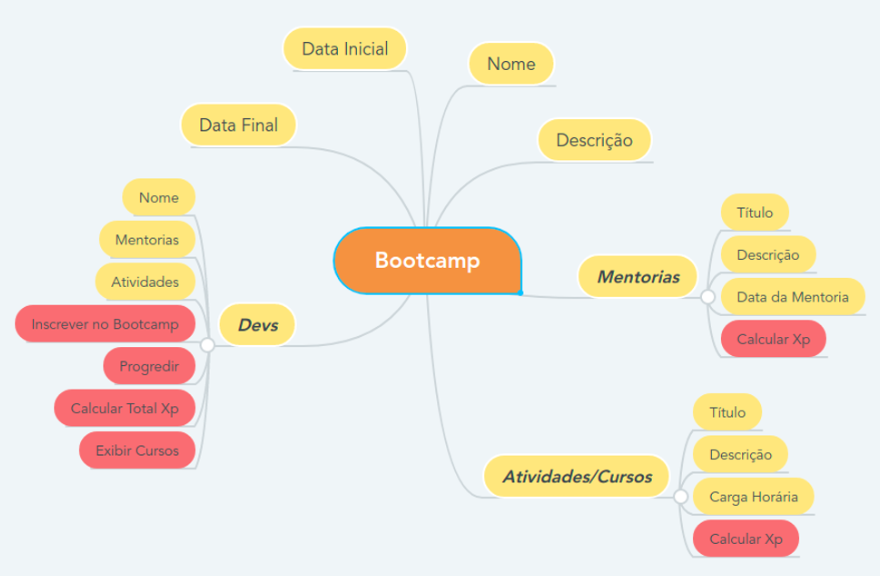

<h1 align="center">
    :books:Desafio DIO - Bootcamp Orange tech:books:
</h1>

<h3 align="center"> 
    Objetivo: Aprender na prática programação orientada a objetos.
</h3>

<h2 align="center">
    :computer:Tecnologias
</h2>

    :white_check_mark: Java JDK 18  
    :white_check_mark: GIT  
    :white_check_mark: IDE Intellij

<a href="https://github.com/cami-la/desafio-poo-dio">Repositório aula</a>